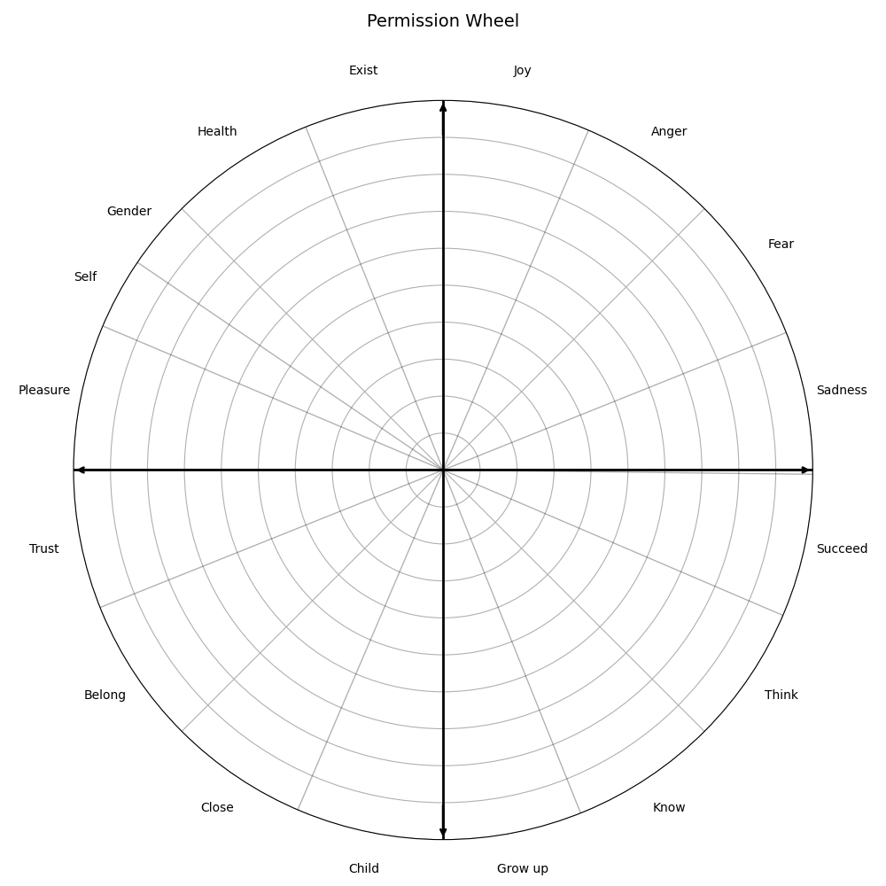
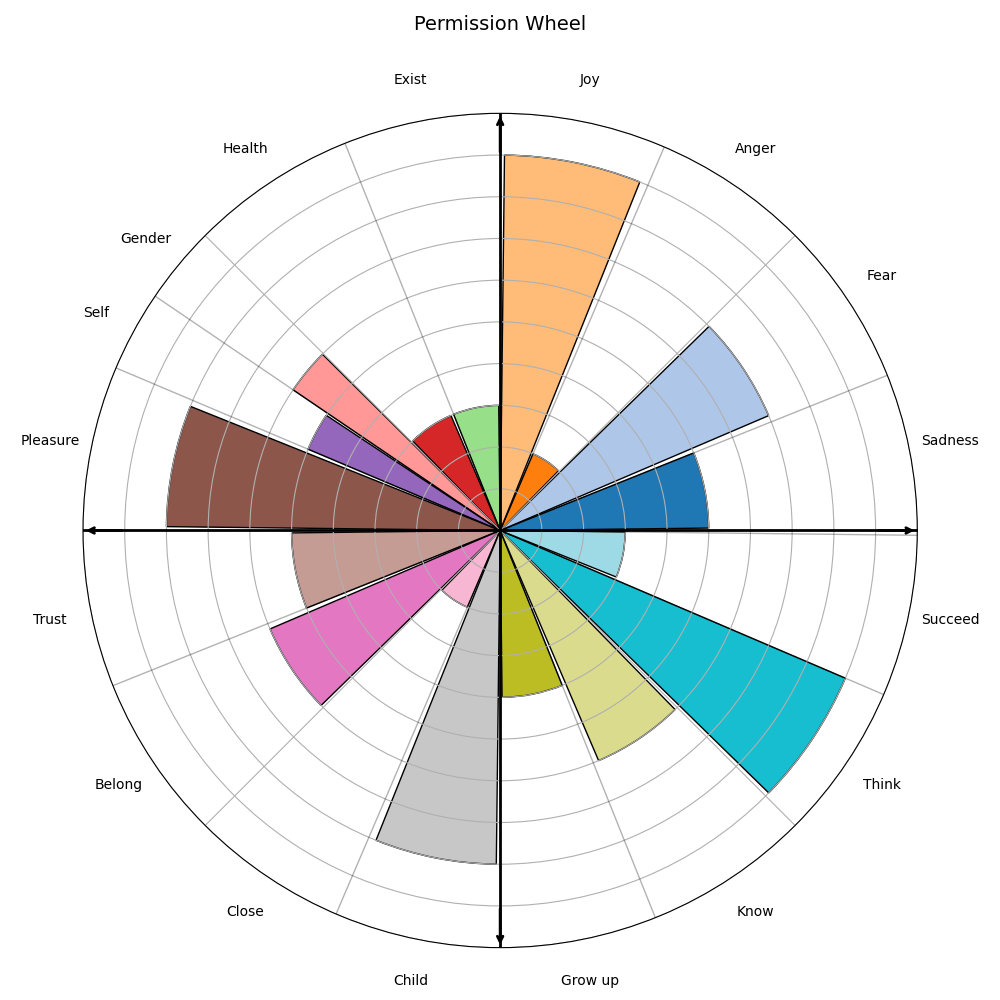

# Rose Chart

Creates the Permission Wheel rose chart

This repostory will not be updated anymore after 1st may 2026

## Data
Follow the example of `zero_values.csv` to create the base data for the chart.

Angles can be changed as required to fit the number of sectors.

For example `rand_values.csv` produces the following chart:

### Newline
To add a newline to the names put `xx` where you want the new line. The script will use this to recognise a new line.

e.g.

`abcd xxefg`

 will give

`abcd`

`efg`
# License

The MIT License (MIT)
Copyright © 2026 higgyone

Permission is hereby granted, free of charge, to any person obtaining a copy of this software and associated documentation files (the “Software”), to deal in the Software without restriction, including without limitation the rights to use, copy, modify, merge, publish, distribute, sublicense, and/or sell copies of the Software, and to permit persons to whom the Software is furnished to do so, subject to the following conditions:

The above copyright notice and this permission notice shall be included in all copies or substantial portions of the Software.

THE SOFTWARE IS PROVIDED “AS IS”, WITHOUT WARRANTY OF ANY KIND, EXPRESS OR IMPLIED, INCLUDING BUT NOT LIMITED TO THE WARRANTIES OF MERCHANTABILITY, FITNESS FOR A PARTICULAR PURPOSE AND NONINFRINGEMENT. IN NO EVENT SHALL THE AUTHORS OR COPYRIGHT HOLDERS BE LIABLE FOR ANY CLAIM, DAMAGES OR OTHER LIABILITY, WHETHER IN AN ACTION OF CONTRACT, TORT OR OTHERWISE, ARISING FROM, OUT OF OR IN CONNECTION WITH THE SOFTWARE OR THE USE OR OTHER DEALINGS IN THE SOFTWARE.
